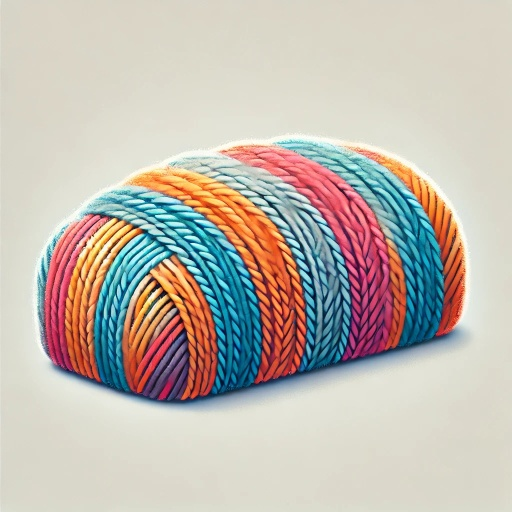

# Threadloaf

Threadloaf is a Chrome extension that enhances Discord's thread view with a more intuitive and readable interface.

## Features

- **Thread View**: Toggle between traditional chat view and an enhanced thread view with a single click
- **Message Threading**: Automatically organizes messages into threaded conversations based on replies and timing
- **Visual Hierarchy**: Recent messages are highlighted with brighter colors, making it easy to track new activity
- **Keyboard Navigation**: Use 'A' and 'Z' keys to quickly navigate between expanded messages
- **Rich Content Support**: Fully supports Discord's rich content including emojis, images, and embeds
- **Message Preview**: See message previews in a compact format, with full content available on click
- **Smart Navigation**: Navigate between parent/child messages and chronologically with arrow buttons

## Installation

1. Install the extension from the Chrome Web Store (link coming soon)
2. Visit Discord in your Chrome browser
3. Look for the "Chat/Thread" toggle button at the bottom of any channel

## Usage

### Basic Navigation

- Click the "Thread" button to switch to thread view
- Click any message to expand it and see the full content
- Click the "Chat" button to return to Discord's standard chat view

### Keyboard Shortcuts

- Press `A` to move to the previous message when a message is expanded
- Press `Z` to move to the next message when a message is expanded

### Message Navigation

When a message is expanded, use the arrow buttons to:
- ← Move to the previous message chronologically
- → Move to the next message chronologically
- ↑ Jump to the parent message (if the current message is a reply)
